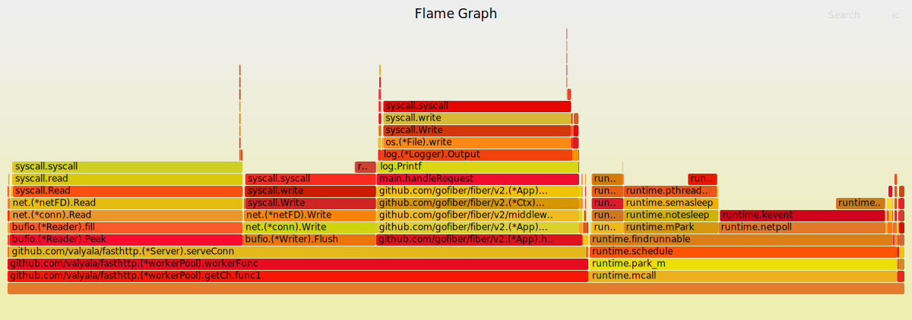

# Flame Graph Go Example

Demonstrating how to use Flame Graph to analyze Go App's performance

## Init Lab

Download flame graph lib

```bash
./download-flame-graph-lib.sh
```

Start go-fiber server

```bash
# Terminal 1
GO111MODULE=on go run main.go
```

## Perform Testing

```bash
# Terminal 2
go tool pprof -raw -output=cpu.txt 'http://localhost:8080/debug/pprof/profile?seconds=20'

# Terminal 3
wrk -d 30s 'http://localhost:8080'
```

## Make Flame Graph

```bash
./flamegraph/stackcollapse-go.pl cpu.txt | ./flamegraph/flamegraph.pl > flame.svg

# Or
./generate-flame-graph.sh
```

## Flame Graph Result



## Load Test Results

```bash
# http
❯ wrk -d 30s 'http://localhost:8080'
Running 30s test @ http://localhost:8080
  2 threads and 10 connections
  Thread Stats   Avg      Stdev     Max   +/- Stdev
    Latency    14.17ms   36.01ms 469.94ms   91.55%
    Req/Sec     9.22k     3.26k   20.88k    71.97%
  539729 requests in 30.04s, 67.94MB read
Requests/sec:  17966.86
Transfer/sec:      2.26MB

# Go Fiber
❯ wrk -d 30s 'http://localhost:8080'
Running 30s test @ http://localhost:8080
  2 threads and 10 connections
  Thread Stats   Avg      Stdev     Max   +/- Stdev
    Latency    10.74ms   24.26ms 314.14ms   89.05%
    Req/Sec     9.84k     3.03k   19.00k    73.12%
  583058 requests in 30.08s, 73.40MB read
Requests/sec:  19381.66
Transfer/sec:      2.44MB
```

## Further Learning

<https://www.practical-go-lessons.com>
